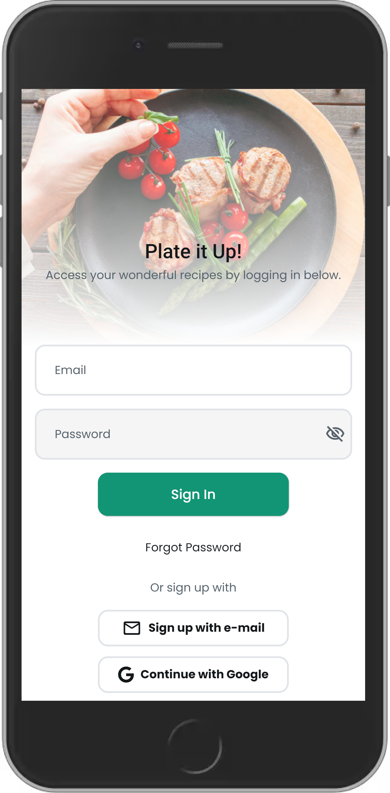
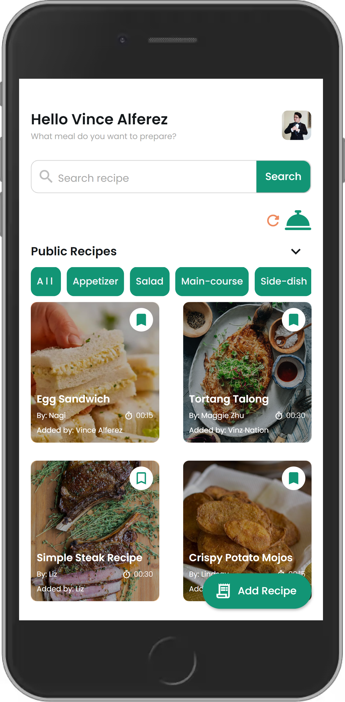
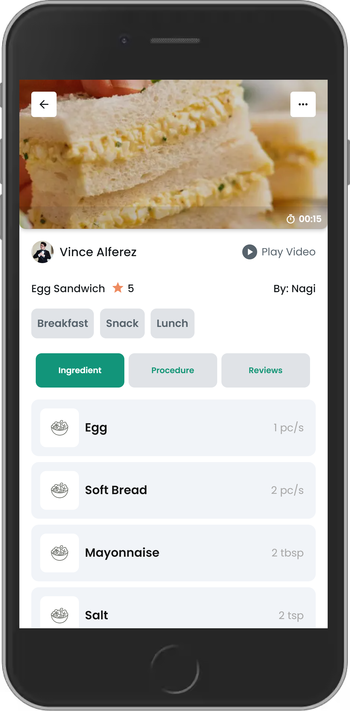
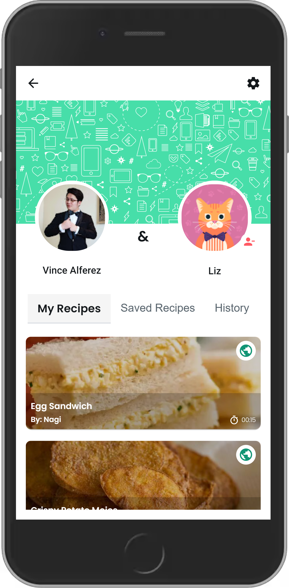
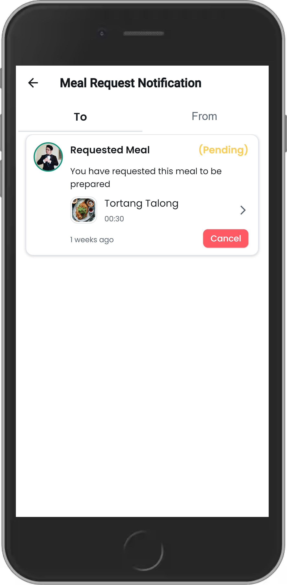
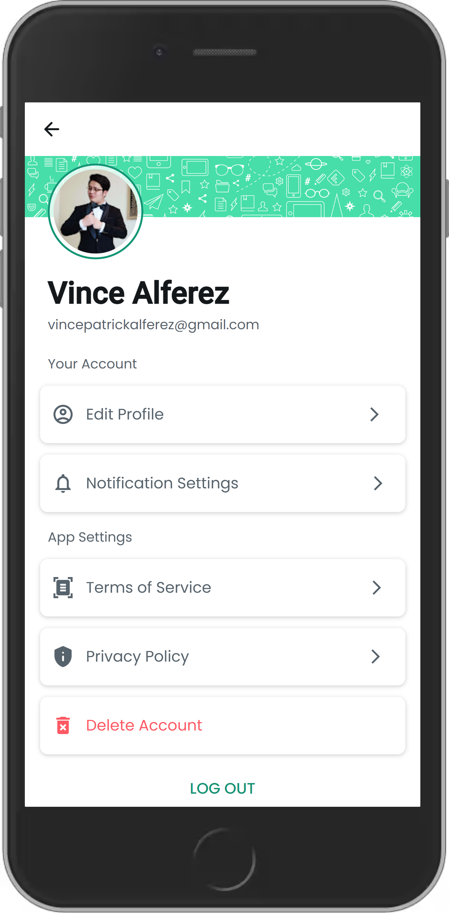

# Plate it Up!

A community recipe app for sharing with your partner or the entire community.

## Table of Contents

- [Features](#features)
- [Installation](#installation)
- [Screenshots](#screenshots)

## Features

- **User Authentication:** Users can sign in with Google or sign up using email without providing birtdate or phone number information.
- **Public Community Recipes:** Users can create public community meal recipes upon account creation.
- **Private Recipes:** Users can set their community meal recipes to public or private, with private recipes viewable only by the creator.
- **Recipe Reporting:** Users can report public recipes to flag them and notify the moderator of any malicious content.
- **Pairing with Others:** Users can pair with others using a unique code to share meal recipes.
- **Account Deletion:** Users can request account deletion to remove their information from the app.
- **Camera Access:** Some app features require camera access if the user chooses not to use a link for image upload.
- **Notification:** Get notifications when paired users share new recipes.

## Installation

### Prerequisites

- Flutter SDK: [Install Flutter](https://flutter.dev/docs/get-started/install)

### Steps

1. Clone the repository:
   ```sh
   git clone https://github.com/vintrickal/plateitup.git
   cd plateitup

2. Install dependencies:
   ```sh
   flutter pub get

3. Run the app:
   ```sh
   flutter run

## Screenshots

### Login


### Home


### Recipe Details


### Profile


### Notifications


### Profile Settings

