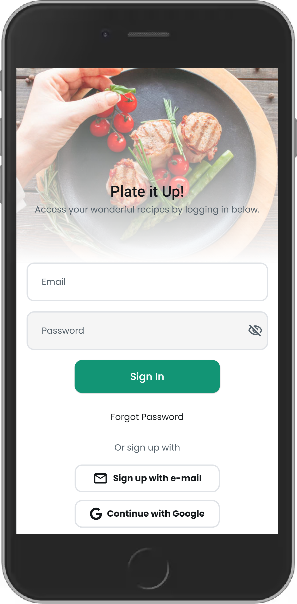
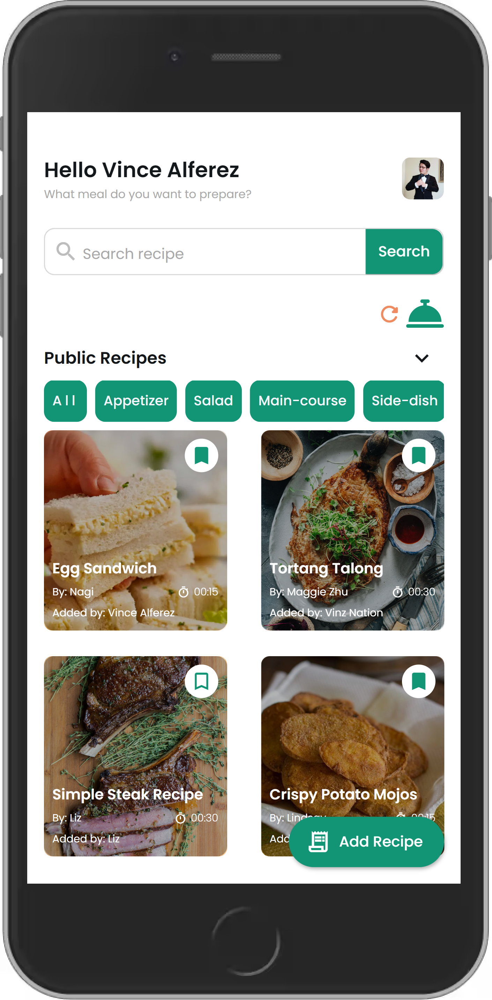
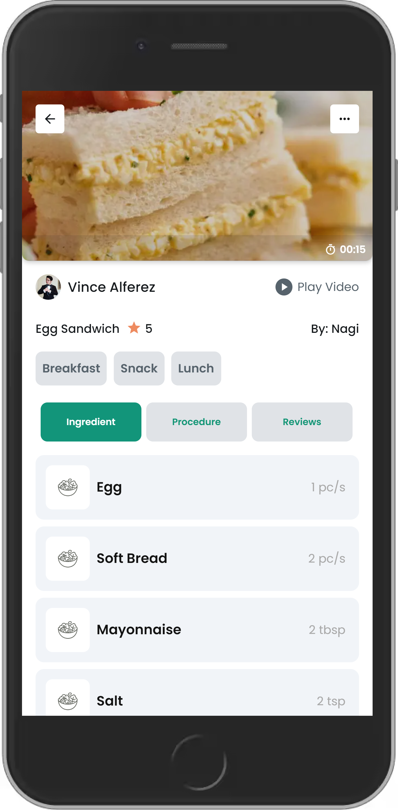
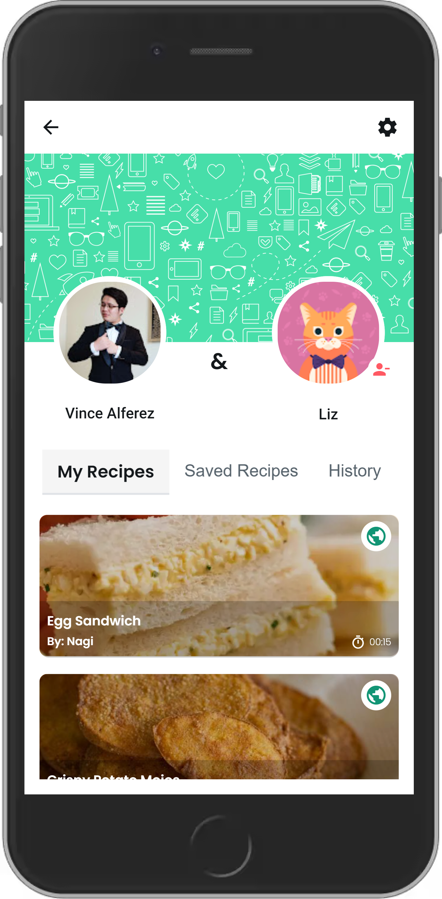
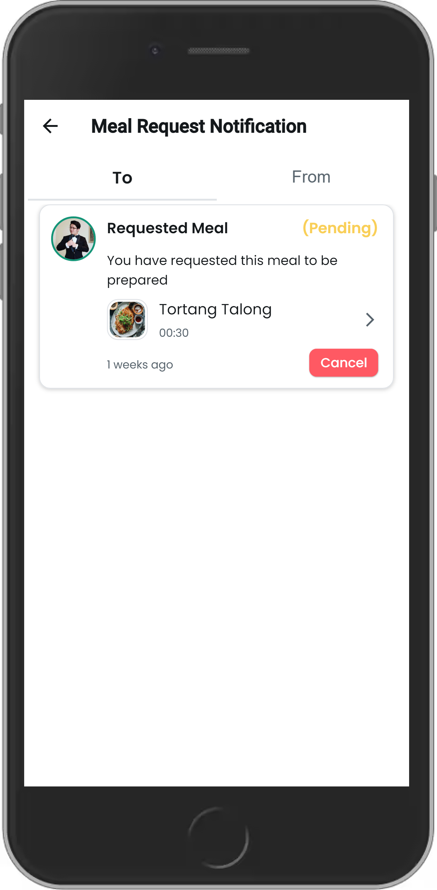
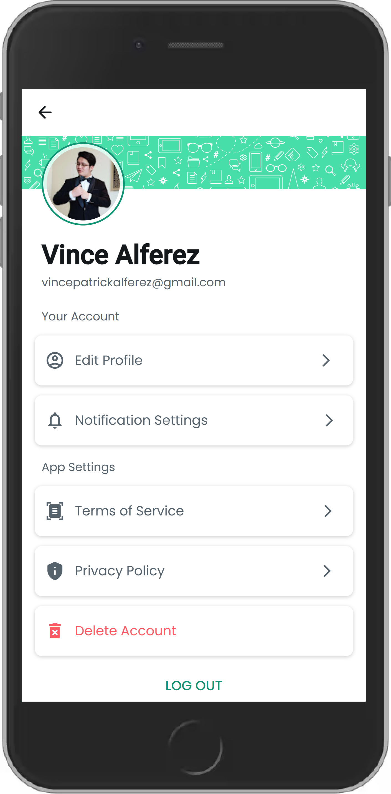

# Plate it Up!

A community recipe app for sharing meals with your partner or the wider community. Save your favorite recipes privately, pair up with someone special to swap meal ideas, or post to the public feed for everyone to discover.

## Table of Contents

- [Features](#features)
- [Tech Stack](#tech-stack)
- [Installation](#installation)
- [Download](#download)
- [Screenshots](#screenshots)
- [Permissions](#permissions)
- [License](#license)

## Features

- **User Authentication** — Sign in with Google or sign up using email. No birthdate or phone number required.
- **Public Community Recipes** — Share recipes with the entire Plate it Up! community after creating an account.
- **Private Recipes** — Toggle any recipe to private so only you can see it.
- **Pair with a Partner** — Connect with another user via a unique pairing code to share recipes one-to-one.
- **Push Notifications** — Get notified when a paired user posts a new recipe.
- **Recipe Reporting** — Flag malicious or inappropriate public recipes for moderator review.
- **Account Deletion** — Request full removal of your account and data at any time.

## Tech Stack

- **Frontend:** Flutter
- **Backend:** _TODO — e.g. Firebase, custom REST API_
- **Authentication:** _TODO — e.g. Firebase Auth, Google Sign-In_
- **Storage:** _TODO — e.g. Cloud Storage / S3_
- **Notifications:** _TODO — e.g. Firebase Cloud Messaging_

## Installation

### Prerequisites

- [Flutter SDK](https://flutter.dev/docs/get-started/install)

### Steps

1. Clone the repository:
   ```sh
   git clone https://github.com/vintrickal/plateitup.git
   cd plateitup
   ```

2. Install dependencies:
   ```sh
   flutter pub get
   ```

3. Run the app:
   ```sh
   flutter run
   ```

## Download

The latest Android build is available on the [Releases](https://github.com/vintrickal/plateitup/releases/latest) page.

> **Note:** Plate it Up! is distributed as an APK outside the Play Store. You may need to enable installs from unknown sources on your device the first time.

## Screenshots

| Login | Home | Recipe Details |
|:-----:|:----:|:--------------:|
|  |  |  |

| Profile | Notifications | Profile Settings |
|:-------:|:-------------:|:----------------:|
|  |  |  |

## Permissions

- **Camera** — Required only if you choose to take a photo for a recipe image instead of uploading via a link.
- **Notifications** — Used to alert you when a paired user shares a new recipe.

## License

_TODO — e.g. MIT, Apache 2.0, or "All rights reserved"._

## Author

Built by [@vintrickal](https://github.com/vintrickal).
